# Olá! Eu sou a Giovanna!

🌱 Desenvolvedora de Software formada em Análise e Desenvolvimento de Sistemas pela FATEC.
🚀 Sempre em busca de novos desafios para aprimorar minhas habilidades e expandir meus horizontes.

##

### Conecte-se comigo

##

### Habilidades

 
  
  
  
  
  
  
  
  

##

### GitHub Stats

  

  

